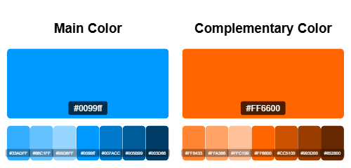

# Complementary Color Generator Tool

This tool allows you to generate complementary colors for any selected color, as well as generate shades and tints to create a more dynamic color palette. Complementary colors are widely used by designers and game developers because they create visually appealing, eye-catching designs. These colors are often found on the color wheel and are commonly used in games to capture user attention.

## Features

- **Generate Complementary Color**: Choose a base color and get its complementary color instantly.
- **Generate Shades and Tints**: Create variations of the selected color by generating shades (darker versions) and tints (lighter versions).
- **Export Palette as PNG**: Save the generated color palette as a PNG file for easy use in your designs and projects.

## Current Issues

Some colors are currently failing to generate shades and tints. This issue is being worked on and will be fixed soon.

## Credits

- **Code generated using ChatGPT**
- **Concept and Bugfixing by Kasun Miuranga**

